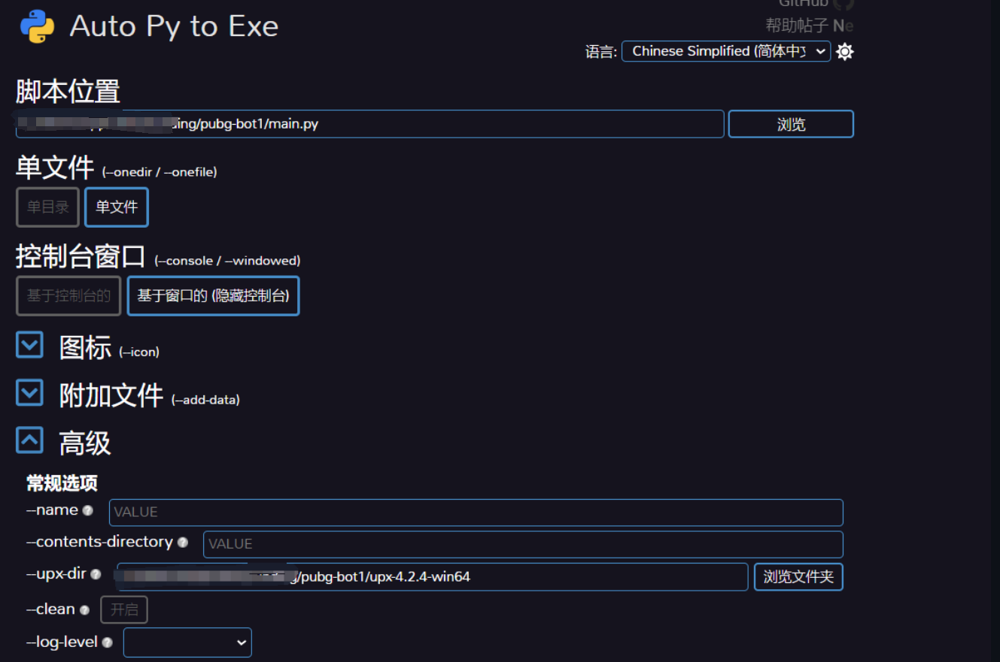

1. 运行环境

python3.10 以上 [下载python](python.org)


```
  python -m venv .venv
  .\.venv\Scripts\activate
  pip install -r requirements.txt
  python main.py
```

逐行执行


2. 打包

```
  auto-py-to-exe
```


